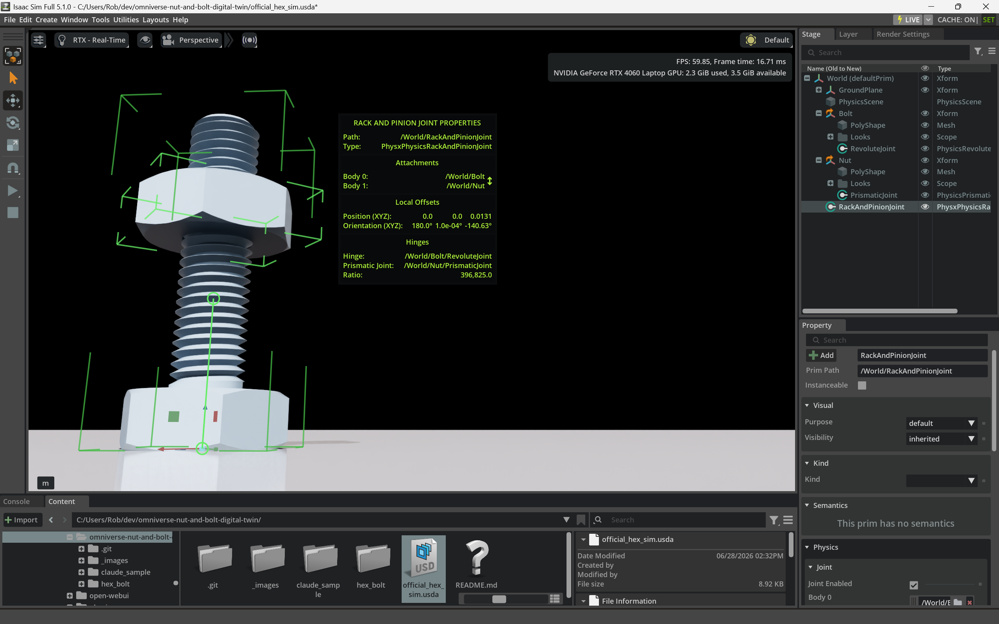

# Omniverse Nut and Bolt Digital Twin
This repository provides a digital twin implementation of a nut-and-bolt assembly, designed for NVIDIA Omniverse Isaac Sim.

It leverages the rack and pinion joint to simulate linear motion from a rotational drive.

[Project Article](https://tech-multiverse.com/projects/how-to-create-a-nut-and-bolt-digital-twin-in-nvidia-omniverse-isaac-sim/)

[Project Video](https://youtu.be/sS73u0BHVP4)

[2 Minute YouTube Short Tutorial!](https://www.youtube.com/shorts/wFAfReHZda4)



## File Overview

* `official_hex_sim.usda`: The Universal Scene Description (USD) file serving as the final digital twin example. This file contains the stage hierarchy, prim properties, and physics constraints required to simulate the nut-and-bolt assembly within Omniverse Isaac Sim.

* `/hex_bolt`: Contains the source CAD assets (.jt) and the USD representing the bolt and nut geometry, which are referenced in the main simulation.

* `/claude_sample`: A supplemental directory containing the Claude generated example Python script (`screw.py`) and the simulation USD (`claude_scripted.usda`) that example script created.

## Versions of the Simulation

This repo now contains three related USD setups so you can pick the one that matches your project.

### 1. `official_hex_sim.usda` — original rack-and-pinion version

* The **bolt** is connected to the world by a `PhysicsRevoluteJoint` and spun by an angular drive (`drive:angular:physics:targetVelocity = 250`).
* The **nut** is connected to the world by a `PhysicsPrismaticJoint` and is therefore constrained to pure up/down motion.
* A `PhysxPhysicsRackAndPinionJoint` couples the bolt's rotation to the nut's translation. Its `physics:ratio` (396,825) is `360 / pitch`, which makes one full bolt revolution move the nut by the thread pitch.

This is the version from the original Tech-Multiverse article and video.

### 2. `official_hex_sim_no_rack_and_pinion.usda` — same motion, no rack-and-pinion

* Identical behavior: the bolt spins and the nut travels up/down the same Z axis.
* Instead of the rack-and-pinion joint, the nut's `PhysicsPrismaticJoint` has a `NewtonMimicAPI` applied to it.
* `newton:mimicJoint` points to the bolt's `RevoluteJoint`, and `newton:mimicCoef1` is the thread pitch per degree (`pitch / 360`).
* The bodies live under a `NutBoltAssembly` prim that has `NewtonArticulationRootAPI` applied, which is required because `NewtonMimicAPI` only works between joints in the same articulation.
* This is a cleaner single-USD alternative when you want to avoid the rack-and-pinion joint and don't need a Python script.

### 3. `static_bolt_spinning_nut.usda` — bolt fixed, nut spins and travels

* The **bolt is fixed** to the world with a `PhysicsFixedJoint`.
* An intermediate `NutSlide` link is connected to the bolt by a prismatic joint.
* The visible **nut** is connected to `NutSlide` by a revolute joint.
* A `PhysxMimicJointAPI:rotZ` on the nut's revolute joint makes the nut spin as `NutSlide` translates.
* Why the drive is on the slider: `PhysxMimicJointAPI` only allows `rotX`/`rotY`/`rotZ` as its instance name, so the *follower* joint must be a revolute. That forces the prismatic joint to be the leader, which is where the linear drive lives.

## Thread-pitch math

All three versions use the same screw relationship:

```text
nut_travel_per_revolution = pitch
linear_velocity           = angular_velocity (deg/s) * (pitch / 360)
```

* For the **rack-and-pinion** joint: `physics:ratio = 360 / pitch` (degrees per meter).
* For `PhysxMimicJointAPI`: `gearing = -(360 / pitch)`.
* For `NewtonMimicAPI` on a prismatic follower driven by a revolute leader: `newton:mimicCoef1 = pitch / 360`.

### Example: 28 TPI / ~0.907 mm pitch

```text
pitch = 0.0254 / 28 = 0.000907142857 m
pitch per degree = 0.000907142857 / 360 = 2.51984127e-6
```

### Example: M10-1.5 (1.5 mm pitch)

```text
pitch = 0.0015 m
pitch per degree = 0.0015 / 360 = 4.16666667e-6
```

If your bolt has a different pitch, replace the relevant constant (`ratio`, `gearing`, or `mimicCoef1`) with the value computed from the actual pitch.

## Tuning notes

* `drive:angular:physics:targetVelocity` or `drive:linear:physics:targetVelocity` changes only the *speed*, not the pitch ratio.
* `physics:lowerLimit` / `physics:upperLimit` on the prismatic joint controls how far the nut can travel.
* Self-collisions are disabled in the articulation-based files to prevent the nut and bolt collision meshes from fighting the screw constraint.

